# GHat

[README IN English](README.md)

* [概述](#概述)
* [要求](#要求)
* [安装方式](#安装方式)
* [快速上手](#快速上手)
* [使用文档](#使用文档)
  * [在空白年份添加图案](#在空白年份添加图案)
  * [在已经存在页面添加图案](#在已经存在页面添加图案)


## 概述
GHat (Github Hat Decorator/Green Hat Decorator) 这是一个用特定的日期文件来装饰GitHub 贡献表（contribution calendar）的小工具。

现在你可以随心所欲在贡献表（contribution calendar）上创建你想要的图案。即便你搞砸了一切，也没关系，只需要删掉相应的repository就可以恢复如初。

它使用GIT_AUTHOR_DATE和GIT_COMMITTER_DATE环境变量使提交显示在过去。

**请注意，GHat将破坏您的存储库的提交历史。因此，最好在新的存储库中使用它。**

Ghat 包含一个 main py 文件 和 一个含 js 的 web。

流程是通过 web 页面定制你想要的图案，web 将会生成一个date.txt。
`date.txt` 包含了 commit 的日期和 commit 的次数，然后 `ghat_main.py` 会读取该文件，并按照文件中的日期和次数进行 commit 最终 push 到你的仓库。

## 要求

* Git
* Python 3.6+
* Works on Linux(not sure), Windows, macOS(not sure)

## 安装方式

最方便的方法:
```python
pip install ghat
```

或者你只需要把 `ghat/ghat_main.py` 文件放到你的仓库文件夹下。
然后使用命令 `python ghat_main.py` 代替 `ghat`.

## 快速上手

在使用之前，确认你的git已经获取了github权限，可以让你push commit 。然后最好再检查你的 `git email` 设置，根据最新的 github 说明 `git email` 需要和你在 github 上留的 email 一致,这样你提交的 commit 才会计入 贡献表：

```
git config --global user.email  "your@email.address"
```

首先打开 python 命令行，cd 进入你的项目仓库目录。

接着你有三个选择:

- 最简单的方式就是使用命令 "ghat" 然后按照提示进行操作:
    ```python
    ghat
    ```

- 或者使用快捷命令初始化一个新的存储库并提交(这将**创建**两个文件 `README.md` 和 `work.txt`):
    ```python
    ghat -i your_repository_url /path/to/date.file
    ```

- 或者使用快捷方式对现有的存储库进行提交(此操作将**创建**和**覆盖**文件' work.txt '):
    ```python
    ghat /path/to/date.file
    ```


## 使用文档

### 在空白年份添加图案

如图现在我的contribution table没有2019年，我将会把图案写入2019年：

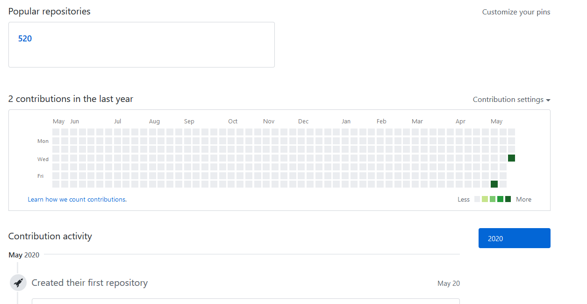

首先创建一个新的仓库，当然你也可以选择在旧的仓库上添加commit。
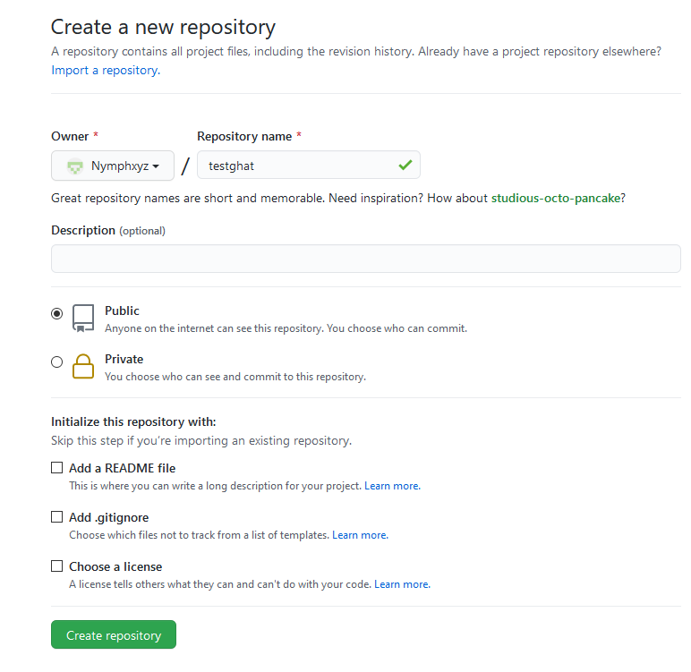

你可以选择打开本地 `ghat.html` 或者 访问在线网站 https://nymphxyz.github.io/ghat/ghat.html 。
即是在本地打开也要确保你的电脑连上了网络，因为 `ghat.html` 调用了github相关的css文件。

选择第一个选项，创建一个空白贡献表：

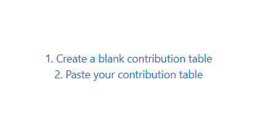

输入年份 2019 然后你会看到一个空白的contribution table：

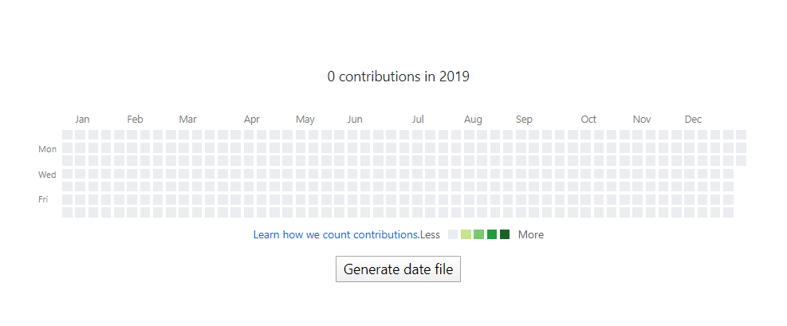

现在按照你的想法点击小方块随意画图吧，左键会增加commit number，右键会减少commit number，所有的颜色计算都与github算法相同。
如下画完图后，点击"Generate date file",将该文件保存至你的repository文件夹。

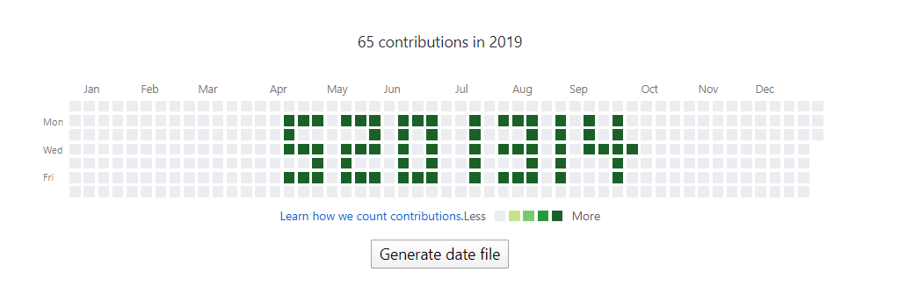

现在创建一个文件夹，并通过命令行进入该文件夹，然后输入命令 `ghat`, 然后按照提示输入每个信息:
我刚发现这里的提示 本地 `ghat.html` 文件路径 是错误的。但是我懒得改了，下次更新再改。
windows 上的话，本地文件在`你的python环境路径\Lib\site-packages\ghat\ghat.html`。

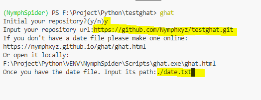


现在按下回车，最后你会看到你的主页已经出现了该图案。
**根据github官网描述，当你满足commit条件后仍然没有在贡献表出现对应的commit，你可能需要等待24小时候才能看到。我自己在不同时间进行了几次测试，的确出现了这种情况，push commit 后贡献表没有发生变化，直到第二天才能看见对应的贡献。**：

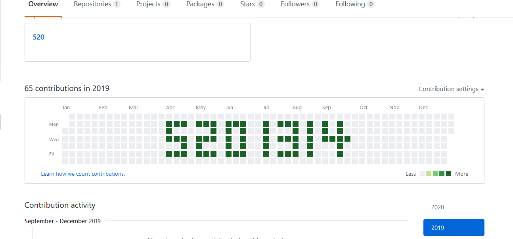

### 在已经存在页面添加图案
如果你想在其他的任意时间段添加图案，需要从github主页copy相关的代码。
如我想在2019年原有的图案上进行修改，因此我需要copy 整一个 svg 的代码：

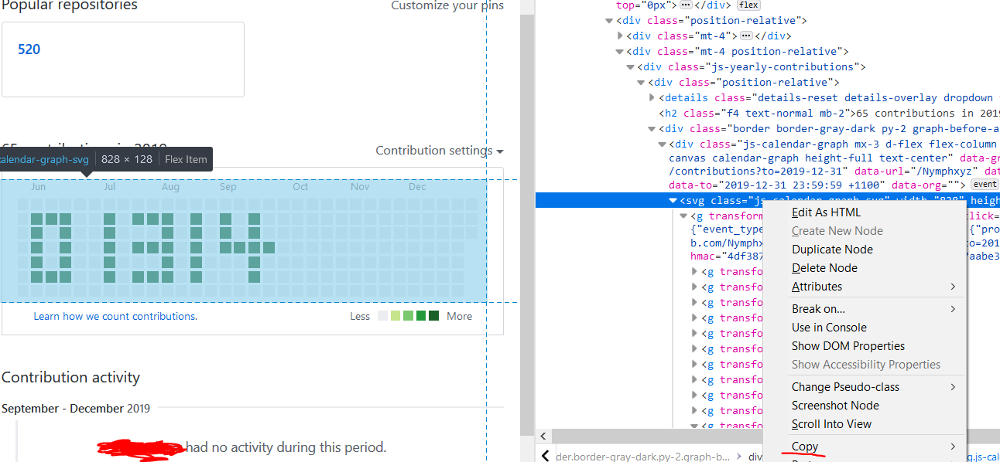

接着打开index.html选择第二个选项，将代码paste至text area：

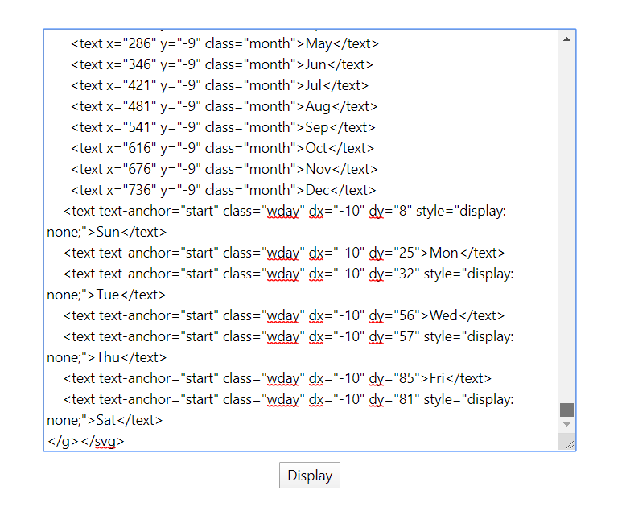

点击display，你将看到你的contribution table 已经被copy过来了：

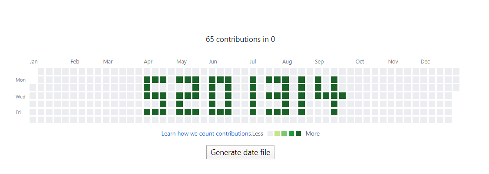

现在尽情修改吧，然后我把它保存为 `date2.txt` ：

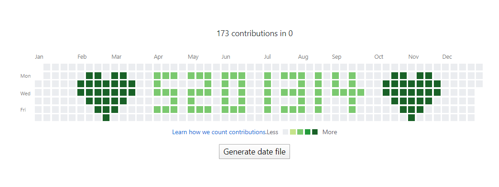


这次我们可以直接在一个仓库中进行commit，并且用快捷命令 `ghat ./date2.txt ` 当然你也可以直接 `ghat` 然后根据提示操作.

现在我的主页就变成这样了：

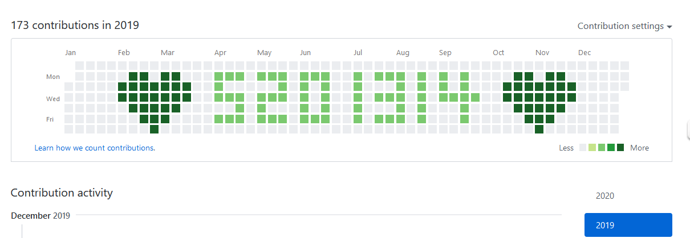


## 借鉴

本项目想法，和 commit date 实现借鉴自 [angusshire greenhat](https://github.com/angusshire/greenhat)